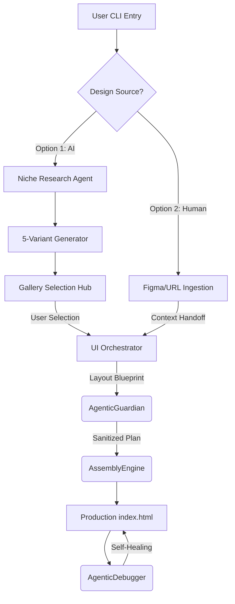

```markdown
# 🧵 Stitcher-Core | Agentic Web Assembly Framework

**Project State:** MVP Phase (Sprint 2 Complete)  
**Last Updated:** February 7, 2026  
**Goal:** Reach "Job-Ready" Portfolio Status by March 2026.

---

## 🏗 System Architecture
Stitcher-Core is a multi-agent framework designed to automate the transition from brand research to high-performance web deployment.
```



---

## 🚀 Core Features

* **Autonomous Research Loop:** The `UIDesigner` performs real-time market research on your specified niche to ensure design competitiveness.
* **Variant Selection Hub:** Generates 5 distinct design directions and hosts them in a local browser-based gallery for stakeholder approval.
* **Human-Agent Collaboration:** Supports manual overrides via Figma or external design URLs.
* **Resource Management:** Optimized "Patch" mode to bypass high-compute generation cycles when making minor iterative changes.

---

## 🛠 Setup & Execution

### 1. Requirements

* **Python 3.10+**
* **Ollama** (Models: `qwen2.5-coder:7b` & `llama3.2:1b`)
* **Tailwind CSS** (via CDN in generated files)

### 2. Installation

```bash
git clone [https://github.com/YOUR_USERNAME/stitcher-core.git](https://github.com/YOUR_USERNAME/stitcher-core.git)
cd stitcher-core
pip install -r requirements.txt

```

### 3. Running the Pipeline

```bash
python main.py

```

*Follow the CLI prompts to choose between **Full Overhaul**, **Figma Override**, or **Resource Patch**.*

---

🛡 System Integrity & Engineering Standards

    Deterministic State Management: Implements strict type-safety and standardized logic flows to ensure predictable agent behavior across high-latency LLM calls.

    Agentic Observability: Comprehensive logging at the "Cognitive Layer" provides a full audit trail of agent reasoning, from niche research to final assembly.

    Computational Resource Optimization: Features a tiered execution strategy (Overhaul vs. Patch) to minimize token consumption and local compute overhead.

    Dynamic Context Injection: Utilizes BOLD UPPERCASE semantic placeholders to ensure safe and accurate data hydration during the final assembly phase.