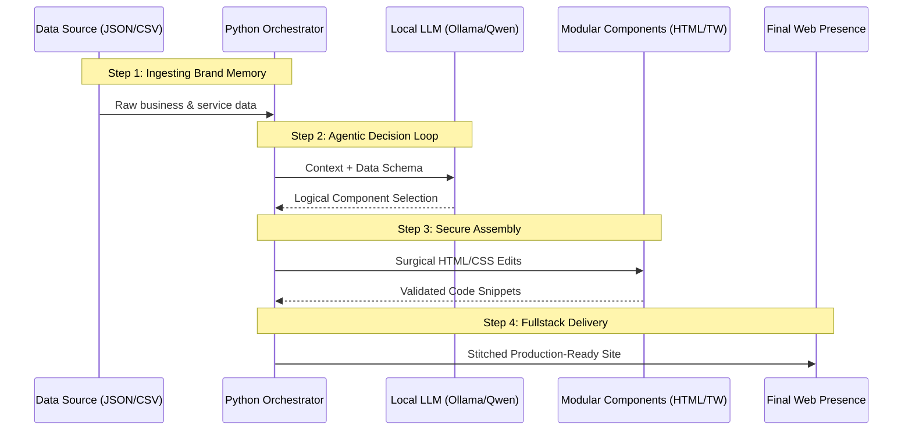

```mermaid
sequenceDiagram
    participant D as Data Source (JSON/CSV)
    participant O as Python Orchestrator
    participant AI as Local LLM (Ollama/Qwen)
    participant C as Modular Components (HTML/TW)
    participant UI as Final Web Presence

    Note over D,O: Step 1: Ingesting Brand Memory
    D->>O: Raw business & service data
    
    Note over O,AI: Step 2: Agentic Decision Loop
    O->>AI: Context + Data Schema
    AI-->>O: Logical Component Selection
    
    Note over O,C: Step 3: Secure Assembly
    O->>C: Surgical HTML/CSS Edits
    C-->>O: Validated Code Snippets
    
    Note over O,UI: Step 4: Fullstack Delivery
    O->>UI: Stitched Production-Ready Site
```
