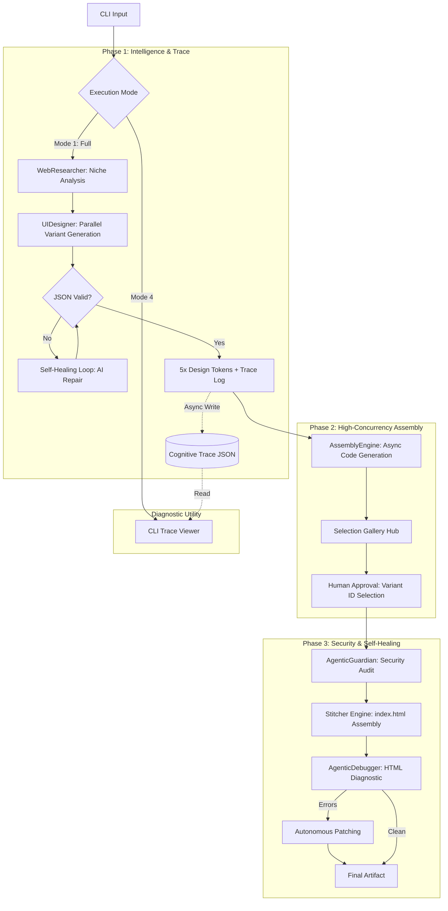

---

# **Stitcher-Core | Agentic Web-Assembly Orchestrator**

**Stitcher-Core** is an advanced autonomous framework for the rapid synthesis of brand-aligned web interfaces. By leveraging asynchronous multi-agent orchestration and self-healing logic, it transforms raw brand intelligence into production-ready, security-audited HTML/Tailwind artifacts.

---

### 1. System Architecture

The framework utilizes a specialized agentic hierarchy to decouple research, design synthesis, and code assembly, ensuring deterministic output from non-deterministic LLMs.

---

### 2. Core Engineering Capabilities

#### **Asynchronous Concurrency**

Engineered for scale using `asyncio`. The system triggers parallel inference tasks across 5 distinct design directions, optimizing compute utilization and reducing the time-to-market for UI iterations.

#### **Autonomous Self-Healing (Recursive Repair)**

Implements a feedback-loop architecture where agents monitor their own output.

* **JSON Integrity:** Automatic detection and repair of malformed schema via `JSONDecodeError` feedback.
* **HTML Diagnostics:** Post-assembly audit scans for structural integrity and Tailwind CSS conflicts, applying autonomous hot-fixes before final deployment.

#### **Enterprise Observability**

The **Cognitive Trace** engine documents the rationale behind every design choice (color theory, font selection, layout hierarchy). This provides an auditable "Decision Trail," bridging the gap between AI black-box output and human-led engineering requirements.

---

### 3. Technical Stack & Agent Hierarchy

| Agent | Responsibility | Core Model |
| --- | --- | --- |
| **Researcher** | Competitive Analysis & Brand Intelligence Extraction | Llama 3.2:1b |
| **UIDesigner** | Visual Token Synthesis & Parallel Prototyping | Llama 3.2:1b |
| **Guardian** | Security Sanitization & Prompt Injection Mitigation | Deterministic |
| **Engine** | High-Fidelity Tailwind/HTML Code Assembly | Qwen 2.5-Coder:7b |
| **Debugger** | Post-Build Diagnostic Audit & Patching | Qwen 2.5-Coder:7b |

---

### 4. Operational Modes

1. **AI Overhaul:** Full research-to-code pipeline with 5-variant parallel generation.
2. **Human Override:** Injection of Figma or external design references into the agentic context.
3. **Targeted Patch:** Resource-efficient mode for content updates using cached design tokens.
4. **Trace Audit:** Real-time CLI inspection of the AI’s cognitive decision logs.

---

### 5. SYSTEM EFFICIENCY

* **Optimized Concurrency:** Utilizes asyncio for non-blocking I/O, allowing the system to manage multiple inference streams simultaneously, maximizing hardware utilization.

* **Resource Management:** Modular design allows for the TARGETED_PATCH mode, which bypasses heavy LLM research and design phases to minimize compute load during minor UI updates.

* **Adaptive Scaling:** Lightweight model selection (Llama 3.2:1b) ensures the pipeline remains functional on consumer-grade hardware while maintaining high-fidelity output.

---

### 6. Development Standards

* **Variable Strategy:** **BOLD UPPERCASE** placeholders for deterministic injection.
* **Logging:** Professional-grade cognitive trace logging for auditability.
* **Deployment:** Modular structure designed for containerized environments.