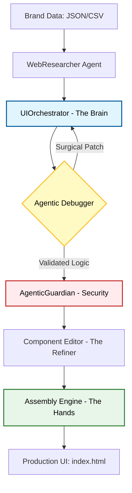

# 🛠️ Stitcher-Core: Secure Agentic Web-Assembly Framework

**Stitcher-Core** is a professional-grade, autonomous pipeline designed to transform raw business data into production-ready web interfaces using local LLMs. By decoupling reasoning (Agents) from execution (Core Engine), the framework achieves high-fidelity results on consumer-grade hardware (**8GB RAM**).

---

## 🏗️ System Architecture

The framework follows a modular "Chain of Thought" architecture, ensuring that every piece of AI-generated content is researched, reasoned, debugged, and secured before assembly.



---

## 🧩 Framework Modules

### **1. Cognitive Layer (Agents)**

* **WebResearcher:** Extracts structured "Brand Memory" from unstructured sources.
* **UIOrchestrator:** A decision-making agent that leverages **Ollama (Llama 3)** to determine optimal layout structures and component selection.

### **2. Resilience & Safety Layer (Core)**

* **Agentic Debugger (Self-Healing):** An autonomous loop that identifies structural failures (e.g., mismatched tags) and performs surgical patches without full code rewrites.
* **AgenticGuardian (Security):** Implements **Defense-in-Depth**. Features include:
* **XSS Prevention:** Input sanitization for malicious scripts and `<iframe>` injections.
* **DoS Mitigation:** Resource guardrails to prevent memory exhaustion on 8GB systems.
* **Forensic Logging:** Maintains `data/security_audit.log` for system observability.


### **3. Assembly & Refinement Layer**

* **Component Editor:** Performs deterministic data injection (pricing, contact info) to eliminate LLM hallucinations.
* **Assembly Engine:** A robust, path-validated builder that stitches modular HTML/Tailwind components into the final document.

---

## 🚀 Deployment (8GB RAM Optimized)

1. **Environment Setup:**
```bash
pip install -r requirements.txt

```


2. **Local LLM:** Ensure [Ollama](https://ollama.ai/) is running with `llama3`.
3. **Execute Pipeline:**
```bash
python main.py

```


---

## 🛠️ Tech Stack

* **Language:** Python 3.9+
* **Inference:** Ollama (Local LLM Orchestration)
* **Security:** Custom Regex-based Sanitization Middleware
* **Styling:** Tailwind CSS (Modular Component Library)

